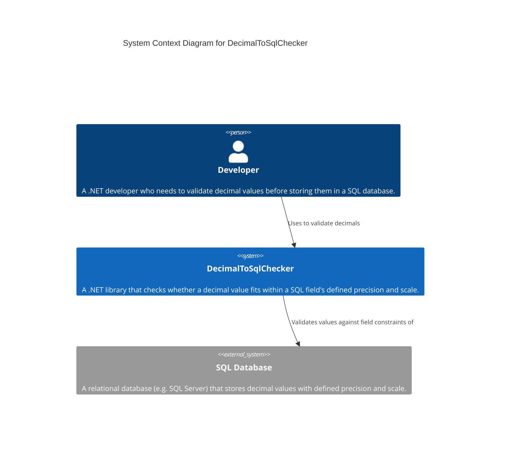
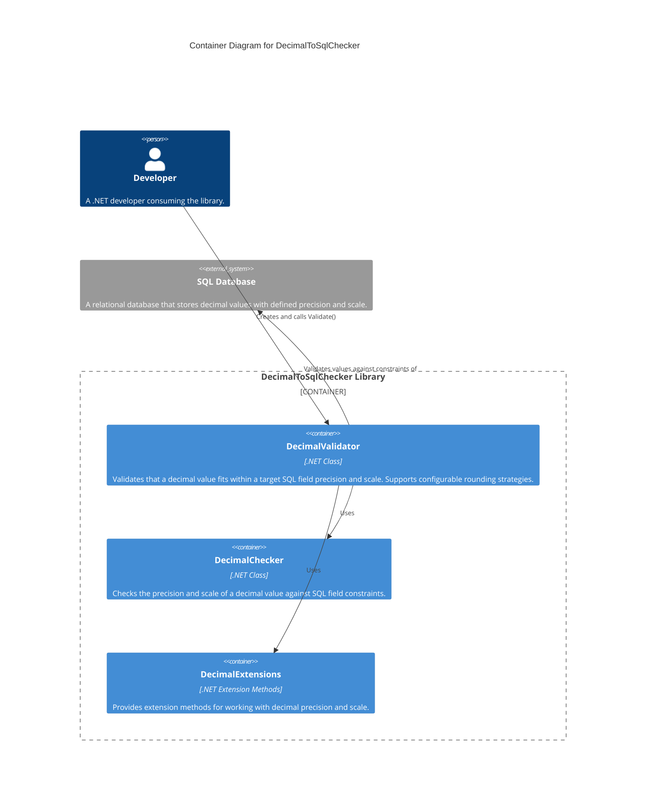

# DecimalToSqlChecker
A small library to help one check that ones decimal values will fit into a sql field with a given precision and scale

[](https://github.com/grimley517/DecimalToSqlChecker/actions/workflows/dotnet.yml)

## Problem

C# decimal values don't always fit into sql fields.  Although an error is raised when one tries to store a value, sometimes you just need to know before that its going to be a problem.

## Solution

This Library checks the scale and precision of a decimal value.

Simple useage

```csharp
    [Theory]
    [InlineData(0.2,  0.2)]
    [InlineData(9.99,  9.99)]
    [InlineData(9.999, 10.00)]
    [InlineData(2.222, 2.22)]
    [InlineData(9.9999,  10.00)]
    [InlineData(9.99999999,  10.00)]
    [InlineData(99.99,  99.99)]
    [InlineData(999.9,  999.9)]
    [InlineData(9999,  9999)]
    [InlineData(9998.00,  9998)]
    public void CheckValidator_Precision4_Scale2_NumericOutput(decimal input, decimal output)
    {
        var validator = new DecimalValidator(targetPrecision: 4, targetScale: 2);
        var output = validator.Validate(input);

        Assert.Equal(expectedOutput, actualOutput);
    }
```

Note that the output will fit into the expected field. It may be rounded, the rounding strategy can be set in the validator.

See the tests for further examples.

## Architecture

### C4 Context View



### C4 Container View


